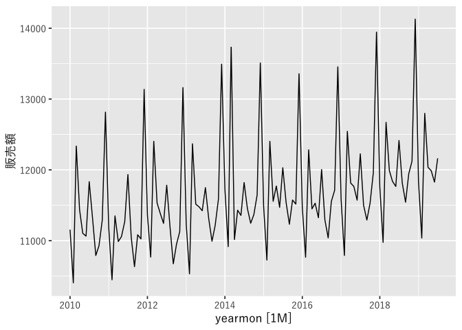
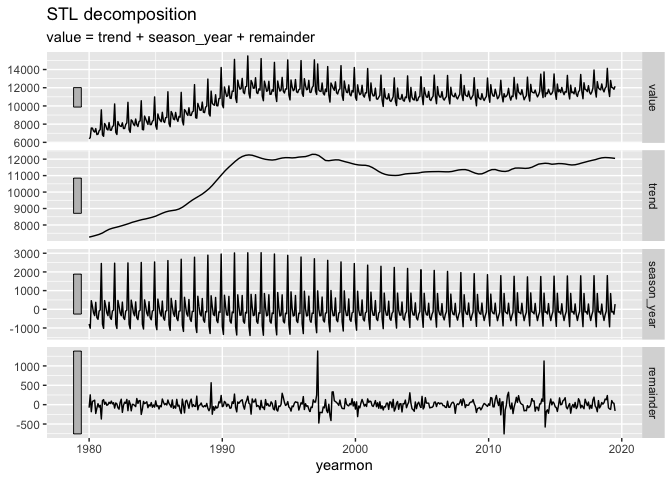

Retail stats in Japan.
================
2019-09-15

## 概要

このデータは経済産業省による商業動態統計を参照しています。同統計は1980年1月から毎月公表されており、数値は10億円単位となっています。

    ## # A tsibble: 475 x 2 [1M]
    ##    yearmon 販売額
    ##      <mth>  <dbl>
    ##  1 1980  1   6396
    ##  2 1980  2   6518
    ##  3 1980  3   7574
    ##  4 1980  4   7557
    ##  5 1980  5   7240
    ##  6 1980  6   7126
    ##  7 1980  7   7512
    ##  8 1980  8   6852
    ##  9 1980  9   6897
    ## 10 1980 10   7270
    ## # … with 465 more rows

    ##     yearmon            販売額     
    ##  Min.   :1980  1   Min.   : 6396  
    ##  1st Qu.:1989 11   1st Qu.:10422  
    ##  Median :1999 10   Median :11191  
    ##  Mean   :1999 10   Mean   :10893  
    ##  3rd Qu.:2009  8   3rd Qu.:11778  
    ##  Max.   :2019  7   Max.   :15492

## 小売業販売額の推移

<!-- -->

統計が開始された1980年はバブル期の後期に、90年代半ばにかけて小売業販売額は大きく増加していました。一方で1990年代半ばから2010年代半ばまで停滞と縮小を繰り返し、2010年代半ば以降は再び増加が見られます。

<!-- -->

上の図は、2010年以降を取り出したものです。このデータには顕著な季節性変動があり、毎年ほぼ同じ形を維持していますが、2014年3月にはこの波形が乱れています。これは翌月に実施された消費税の増税の影響ではないかと考えられます。

## feasts による季節性変動のグラフ

<!-- -->

消費増税の影響は1990年代に行われた3%から5%への増税の際にも見られます。 `feasts`
パッケージによる季節性変動にフォーカスしたグラフでも3月のグラフのなかに値がジャンプしている箇所が見られます。

<!-- -->

## STL decomposition

次に、`feasts::STL()`使用して時系列データを成分毎に分解します。消費増税の影響が remainder として捉えられています。

<!-- -->

さらに `anomalize::anomalize()` を使って異常値にマークをつけます。ここでも季節性分解の手法としては STL
を用いていま す。

<!-- -->

<!-- -->

出典：[経済産業省
商業動態統計](https://www.meti.go.jp/statistics/tyo/syoudou/result-2/index.html)
