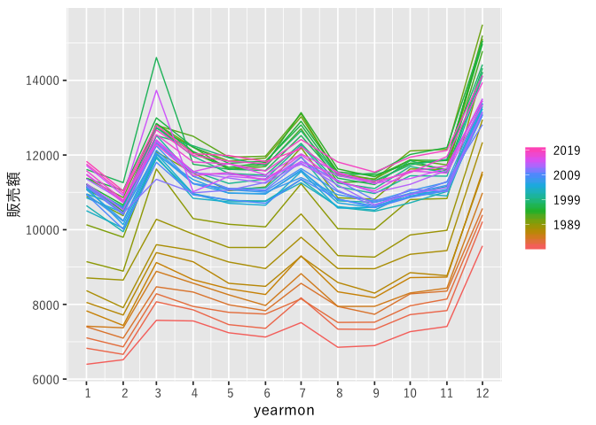

Retail stats in Japan.
================
2019-09-15

情報源：<https://www.meti.go.jp/statistics/tyo/syoudou/result-2/index.html>

## Data

    ## # A tibble: 1 x 4
    ##   oldest     lastest      row  ncol
    ##   <date>     <date>     <int> <int>
    ## 1 1980-01-01 2019-04-01 13216     5

## 小売業販売額の推移

<!-- -->

<!-- -->

<!-- -->

## STL decomposition

<!-- -->
